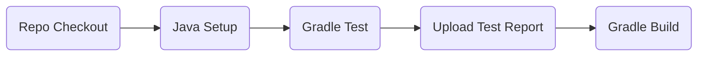
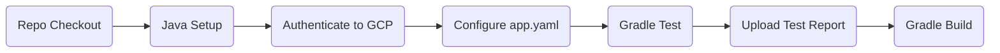

# BornIn

BornIn is a basic SpringBoot application that stores and manages user's date of birth information. Try it out [here](https://rev-dev-project.ey.r.appspot.com/)! 

### What will you need?
#### Local Build&Run
* JDK 17 or later
* Gradle 7.3+

#### Deployment 
All infrastructure configuration needed for deploying this application can be found in [this repository](https://github.com/exosolarplanet/terraform-config).
The main components are:
* App Engine
* Cloud SQL

## Endpoints
| Endpoint | Description | Request Type | Return Code | Return Body |
| --- | --- | --- | --- | --- |
| `/health` | check for application health | GET | 200 | "Healthy" |
| `/hello/{username}?dateOfBirth` | save date of birth information for username | PUT | 204 | n/a |
| `/hello/{username}` | return saved date of birth information for username | GET | 200 | "{ "message": "Hello, <username>! Your birthday is in N day(s)" }" **or** "{ "message": "Happy birthday!" }"  |

## Quickstart
### Local Build & Testing
###### Clone project
`git clone https://github.com/exosolarplanet/BornIn.git`

###### Test gradle application
`./gradlew clean test`

###### Build gradle application
`./gradlew clean build`

###### Run gradle application
`./gradlew clean bootRunLocal`
>bootRunLocal task sets spring profile for local running and testing purposes

###### Test endpoints locally
```
curl -X GET localhost:8080/health
curl -X PUT localhost:8080/hello/<username>?dateOfBirth=<date-of-birth>
curl -X GET localhost:8080/hello/<username>
```

###### Test App Engine endpoints 
```
curl -X GET https://rev-dev-project.ey.r.appspot.com/health
curl -X PUT https://rev-dev-project.ey.r.appspot.com/hello/<username>?dateOfBirth=<date-of-birth>
curl -X GET https://rev-dev-project.ey.r.appspot.com/hello/<username> 
```

### Build&Testing with Github CI/CD workflows
* Build workflow is triggered by a push to main or a feature branch


### Deployment
* Deployment workflow is triggered by a published Github release



